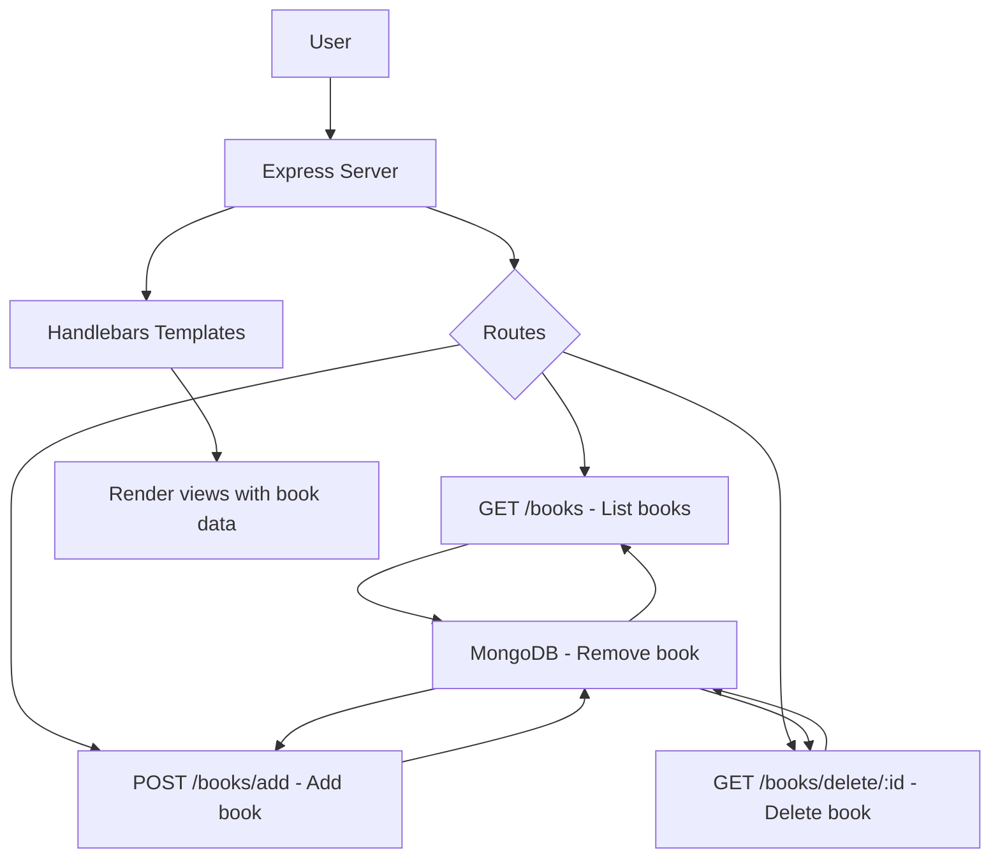
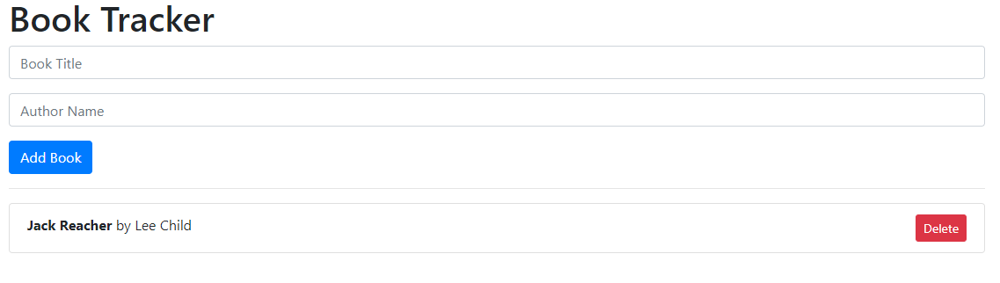

---

# Book Tracker

Book Tracker is a simple CRUD (Create, Read, Update, Delete) web application that allows users to track books they are reading or planning to read. Built using **Node.js**, **Express**, **Handlebars**, and **MongoDB**, it enables users to add, delete, and view a list of books.

## Features
- Add a book with a title and author.
- View all added books.
- Delete a book from the list.
- Uses Handlebars for templating.
- MongoDB for storing book data.

## Project Structure

```bash
book-tracker/
├── models/
│   └── Book.js        # Mongoose schema for the books
├── routes/
│   └── books.js       # Routes handling book operations
├── views/
│   ├── layouts/
│   │   └── main.hbs   # Main layout template
│   └── index.hbs      # Template for displaying the book list
├── app.js             # Main application entry point
├── package.json       # Project metadata and dependencies
├── screen.png         # Screenshot of the application
└── README.md          # Project documentation
```

### Project Flowchart (Mermaid)



## Installation

1. Clone the repository:

    ```bash
    git clone https://github.com/your-username/book-tracker.git
    cd book-tracker
    ```

2. Install dependencies:

    ```bash
    npm install
    ```

3. Start MongoDB:

    Make sure MongoDB is running on your system. If you haven't installed it, follow the [MongoDB installation guide](https://docs.mongodb.com/manual/installation/).

4. Start the server:

    ```bash
    node app.js
    ```

5. Visit the application:

    Open your browser and go to `http://localhost:5000/books` to view the app.

## Usage

1. **Adding a Book:**
   - On the main page, enter the book title and author's name in the form and click "Add Book."

2. **Viewing Books:**
   - All added books will be listed below the form.

3. **Deleting a Book:**
   - To remove a book, click the "Delete" button next to the book.

## Screenshot

Here is a screenshot of the Book Tracker in action:



## Technologies Used

- **Node.js**: Server-side JavaScript runtime.
- **Express.js**: Fast and lightweight web framework for Node.js.
- **Handlebars**: Templating engine for rendering dynamic HTML.
- **MongoDB**: NoSQL database for storing book data.
- **Mongoose**: MongoDB ODM to easily work with the database.

## Contributing

1. Fork the project.
2. Create your feature branch: `git checkout -b feature-name`.
3. Commit your changes: `git commit -m 'Add some feature'`.
4. Push to the branch: `git push origin feature-name`.
5. Submit a pull request.

## License

This project is licensed under the MIT License. See the [LICENSE](LICENSE) file for details.

---
